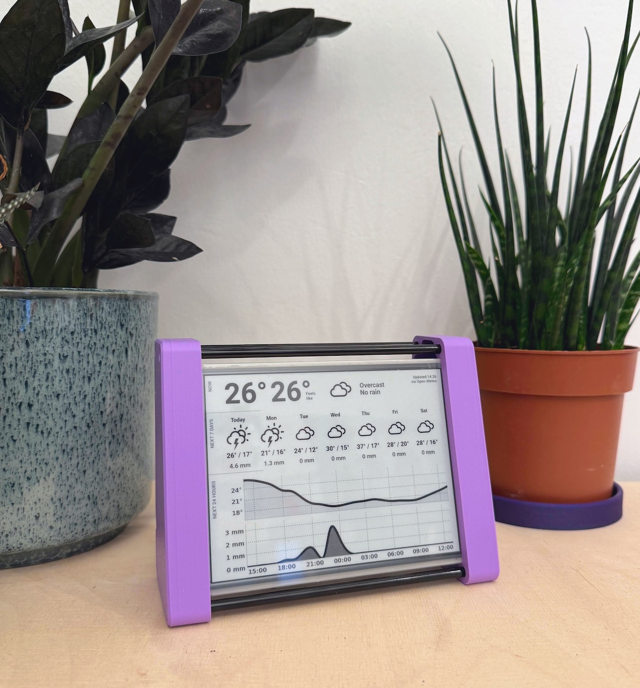
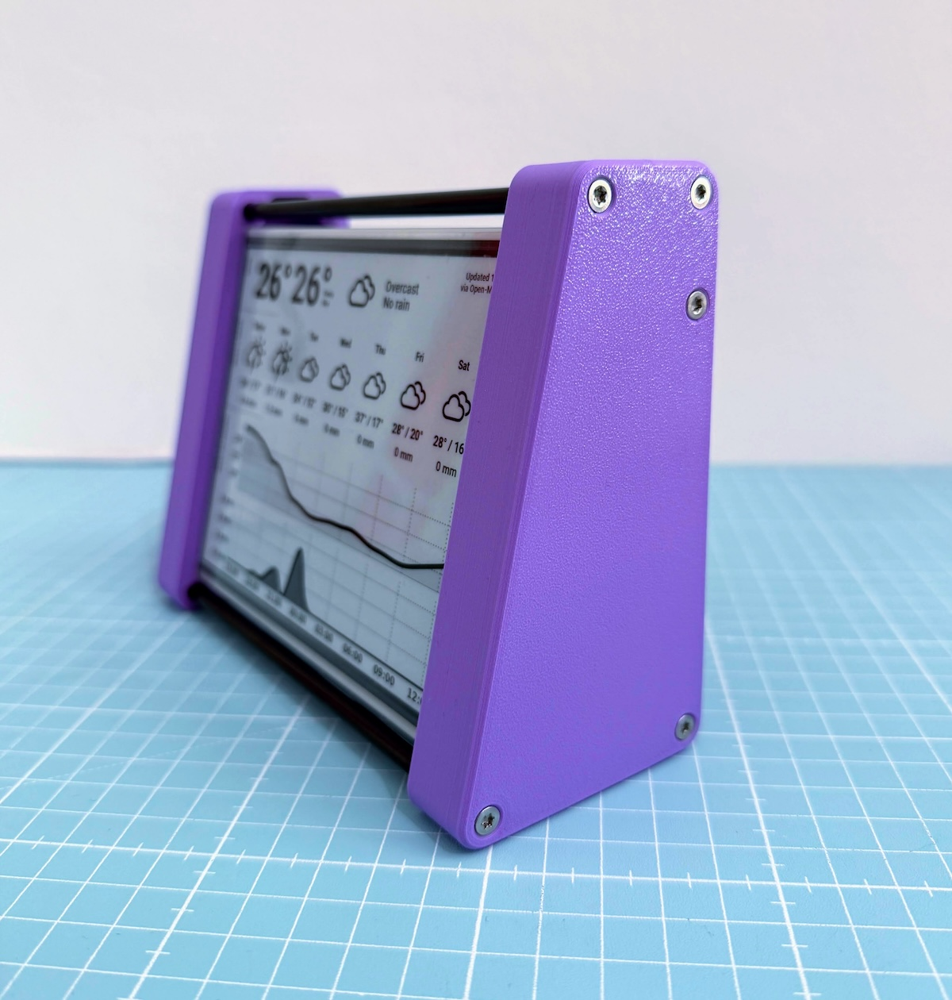
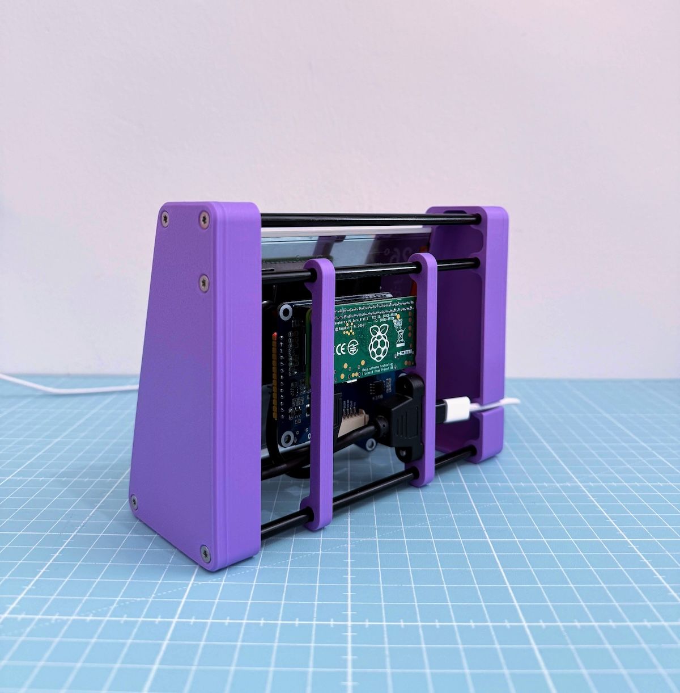

# Raspberry Pi Weather Display

A small tool that gets weather forecasts from the internet and displays it on an e-ink display.

The e-ink display is a Waveshare 6inch HD model with a resolution of 1448*1072: https://www.waveshare.com/wiki/6inch_HD_e-Paper_HAT

Notable dependencies are:

1. The IT8951 driver to interface with the e-ink display: [github.com/GregDMeyer/IT8951](https://github.com/GregDMeyer/IT8951)
2. A wrapper around the OpenWeatherMap web API: [github.com/csparpa/pyowm](https://github.com/csparpa/pyowm)
3. Weather icons: [github.com/erikflowers/weather-icons](https://github.com/erikflowers/weather-icons)

There is also a CAD model of an enclosure that can be 3D printed: [enclosure.stl](enclosure.stl)

Currently 2 weather providers are supported. They are both free but signup is required to get the necessary API key:

- [openweathermap.org/api](https://openweathermap.org/api)
- [tomorrow.io/weather-api](https://www.tomorrow.io/weather-api/)

## Photos

Example display image:


Photo of completed unit:







## Install

Install package requirements using `apt` if running on a Raspberry Pi:

```console
apt update
apt install python3-pandas python3-pil python3-matplotlib python3-scipy python3-pip python3-setuptools git vim
```

Then install this tool using pip:

```console
pip3 install --break-system-packages https://github.com/GregDMeyer/IT8951/archive/master.zip
pip3 install --break-system-packages https://github.com/FutureSharks/rpi-weather-display/archive/master.zip
```

And run it and it will update the e-ink display:

```console
rpi-weather-display --api-key <OMW API key>
```

Or to optionally run it as a service via `systemd`:

```bash
echo -e "[Unit]\nDescription=RPi Weather Display Service\nAfter=network.target\n\n[Service]\nExecStart=/usr/local/bin/rpi-weather-display\nRestart=always\nRestartSec=5\nUser=root\n\n[Install]\nWantedBy=multi-user.target" > /etc/systemd/system/rpi-weather-display.service
systemctl daemon-reload && systemctl start rpi-weather-display && systemctl enable rpi-weather-display
```
