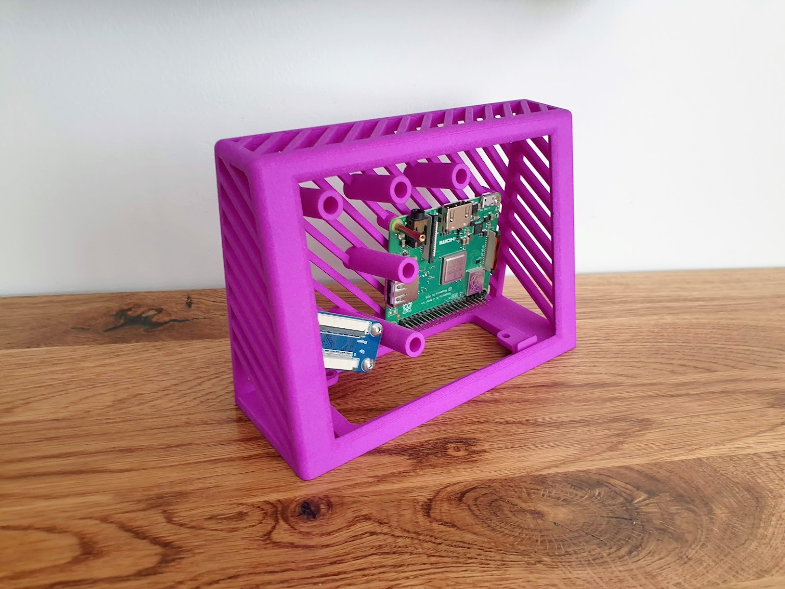
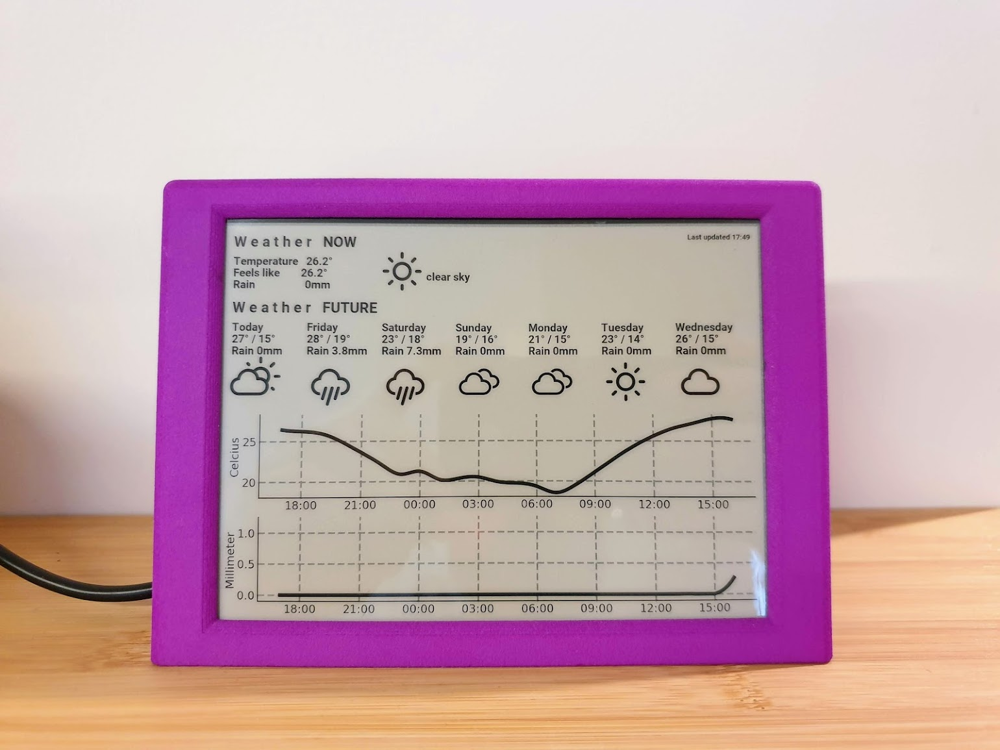

# Raspberry Pi Weather Display

A small tool that gets weather forecasts from the internet and displays it on an e-ink display.

The e-ink display is a Waveshare 6inch HD model with a resolution of 1448*1072: https://www.waveshare.com/wiki/6inch_HD_e-Paper_HAT

Notable dependencies are:

1. The IT8951 driver to interface with the e-ink display: [github.com/GregDMeyer/IT8951](https://github.com/GregDMeyer/IT8951)
2. A wrapper around the OpenWeatherMap web API: [github.com/csparpa/pyowm](https://github.com/csparpa/pyowm)
3. Weather icons: [github.com/erikflowers/weather-icons](https://github.com/erikflowers/weather-icons)

## Photos

Example display image:


Photo of completed unit:





## Install

Install package requirements:

```console
apt update
apt install python3-pandas python3-pil python3-matplotlib python3-scipy
```

Then install this tool using pip:

```console
pip3 install https://github.com/FutureSharks/rpi-weather-display/archive/master.zip
```

And to optionally run it via cron:

```console
echo -e '#!/bin/sh\npgrep -f /usr/local/bin/rpi-weather-display > /dev/null || (rpi-weather-display --api-key <OMW API key> &)' > /etc/cron.hourly/rpi-weather-display
chmod 0755 /etc/cron.hourly/rpi-weather-display
```
